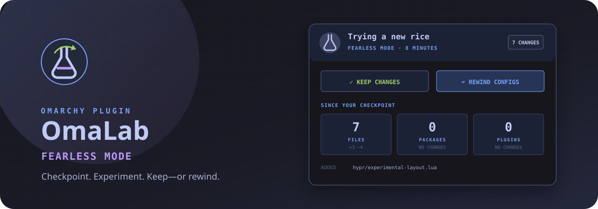

# OmaRewind



**Fearless Mode for Omarchy.** Capture your desktop configuration, experiment
freely, then keep the result or rewind to exactly where you started.

OmaRewind is an Omarchy 4 bar plugin built for the moment before you install a
wild theme, replace your keybindings, or try an unfamiliar plugin and think:
*I hope I can get back from this.*

## What it does

- Creates a local checkpoint of Omarchy, Hyprland, supported terminal, and
  common shell-tool configuration without requiring root.
- Watches the experiment and reports added, changed, and removed files.
- Tracks explicit package and enabled-plugin changes.
- Restores checkpointed configuration after an explicit two-step confirmation.
- Preserves the experiment before every rewind, so the last rewind can itself
  be undone from the panel.
- Restores the starting Omarchy theme when it changed.
- Preserves OmaRewind's own installed plugin directory during a rewind.
- Archives kept and rewound experiments under
  `~/.local/state/omarewind/history/`.
- Opens Omarchy's official `omarchy snapshot create` flow for an optional root
  snapshot before package or kernel experiments.

Package changes are **reported but never automatically installed or removed**.
A configuration rewind is predictable; silently changing the
system package set is not.

## The experience

When idle, OmaRewind is a small history icon in the bar. Give the experiment an
optional name, start Fearless Mode, and it becomes a live badge:

```text
FEARLESS · 7
```

The panel separates file, package, and plugin changes, shows recent modified
paths, and opens a bounded unified diff when a path is clicked. It offers two
intentional exits:

- **Keep Changes** archives the checkpoint and leaves the experiment in place.
- **Rewind Configs** restores the checkpoint and archives a record of what was
  rewound.

Changed files appear as clickable rows beneath **Recent Configuration Changes**.
Click a row to inspect its diff; **Rewind Configs** at the top restores every
listed configuration file. If the panel shows `0 changes`, there is nothing to
rewind yet—make a theme, bar, keybinding, or terminal change and wait a few
seconds for the live scan.

Both actions require a second click within five seconds. The same flow is fully
keyboard accessible with `S`, `K`, `R`, `U`, and `Esc`.

Active and idle scan intervals can be tuned from Omarchy's bar-widget settings;
the defaults are five and thirty seconds respectively.

After a rewind, the idle panel offers **Undo Last Rewind**. OmaRewind can do
that because it captures the experiment into the owner-only local
state directory before restoring anything. Undo also uses a two-step
confirmation and preserves the post-rewind state before it acts.

## Development install

The repository root is the plugin root. Link it into the user plugin directory
so QML changes hot-reload while developing:

```bash
ln -s "$HOME/Work/omarewind" \
  "$HOME/.config/omarchy/plugins/com.omarchy.omarewind"
omarchy shell shell rescanPlugins
omarchy plugin enable com.omarchy.omarewind --section right
```

Remove the development link with:

```bash
omarchy plugin disable com.omarchy.omarewind
rm "$HOME/.config/omarchy/plugins/com.omarchy.omarewind"
omarchy shell shell rescanPlugins
```

No user configuration is modified merely by cloning this repository or running
the tests.

## Command-line interface

The QML interface uses the same auditable command available to users:

```bash
bin/omarewind start "Trying a new rice"
bin/omarewind status
bin/omarewind preview ".config/hypr/bindings.lua"
bin/omarewind keep --yes
bin/omarewind rewind --yes
bin/omarewind undo --yes
bin/omarewind history
bin/omarewind doctor
```

`status` is stable JSON so the bar, tests, and future integrations all observe
the same state.

## Protected configuration

OmaRewind checkpoints these targets when they exist:

- `~/.config/hypr/`
- `~/.config/omarchy/`
- Alacritty, Foot, Kitty, and Ghostty configuration
- Starship, Fastfetch, btop, Lazygit, and Git configuration

Git metadata is excluded. OmaRewind's own plugin directory is also excluded
from both checkpoint and deletion passes, preventing the restore engine from
replacing itself while it is running.

This is a local configuration safety net, **not a backup of personal files**.
Documents, projects, photos, and other user data are intentionally out of
scope. Root snapshots are delegated to Omarchy's existing Snapper integration.

## Safety model

- Restore targets are a fixed allowlist below `~/.config/`.
- Checkpoint files are integrity-checked before any restore begins.
- A tracked directory replaced by a symlink is unlinked before restore, so
  `rsync --delete` cannot follow it outside the configuration tree.
- Shared/exclusive file locks serialize status scans and destructive actions.
- Failed scans clean their temporary state and never replace the last-good UI
  state with a false “inactive” result.
- The backend refuses a rewind without `--yes`.
- The UI requires a second confirmation within five seconds for keep, rewind,
  and undo.
- No network access, telemetry, root daemon, or credential storage.
- State is created with owner-only permissions (`0700` directories and a
  `0600` lock file).
- Package changes are observational only.
- Checkpoint creation is atomic: an incomplete checkpoint never becomes active.
- Rewinds, their experiments, and pre-undo safety copies are archived rather
  than silently discarded.

The complete trust boundary and failure behavior are documented in
[`SECURITY.md`](SECURITY.md). The backend invariants and state layout are in
[`ARCHITECTURE.md`](ARCHITECTURE.md).

## Test

```bash
test/all
```

The test suite uses an isolated fake home directory. It verifies change
detection, confirmation enforcement, restoration, rewind undo, checkpoint
integrity, concurrent starts, locale independence, symlink-escape resistance,
temporary-state cleanup, owner-only permissions, history, self-preservation,
manifest validity, shell syntax, and QML linting without touching the live
desktop configuration.

## Roadmap

- A full visual experiment timeline with search and filtering.
- Selective per-file rewind directly from the diff preview.
- Package reconciliation plans that open in a terminal for explicit review.
- Snapper checkpoint detection and pairing without maintaining a privileged
  daemon.
- Disk-usage and snapshot-health warnings.
- Exportable, privacy-safe experiment reports for support requests.

## License

MIT
